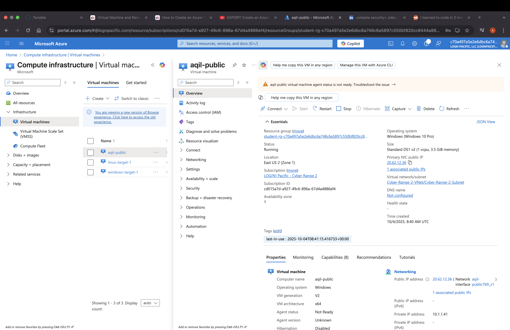

# Azure NSG & VM Connectivity

## Objective
Configure and analyze how Azure **Network Security Groups (NSGs)** control inbound and outbound access to a Windows virtual machine with a public IP. Demonstrate how allowing or restricting specific ports and protocols (RDP, ICMP) impacts real network connectivity.

---

## Environment
- **Cloud:** Microsoft Azure (East US 2)  
- **Host VM:** Windows 10 (Public IP assigned)  
- **Client:** macOS Terminal for connectivity testing  
- **Tools:** Azure Portal, Remote Desktop Protocol (RDP), Windows Defender Firewall  

---

## Implementation Steps

### 1. Create Resource Group and Virtual Machine
Deploy a Windows VM with a public IP and verify associated Azure components.

**Steps:**
- Created a new Resource Group in Azure.
- Deployed a Windows 10 VM with a public IP.
- Confirmed that NIC, disk, and IP resources were properly associated.

**Screenshots:**
<p align="center">
  
</p>

<p align="center">
  
</p>

---

### 2. Connect via RDP
Verify remote access to the VM using Remote Desktop Protocol.

**Steps:**
- Connected to the VM via RDP using its public IP.
- Verified successful login and remote access functionality.

**Screenshot:**
<p align="center">
  
</p>

---

### 3. Windows Firewall (for Isolation)
Temporarily disable the Windows Firewall to focus on NSG-level traffic filtering.

**Steps:**
- Opened Windows Defender Firewall settings.
- Disabled all profiles (Domain, Private, Public) to prevent OS-level filtering.

**Screenshots:**
<p align="center">
  
</p>

<p align="center">
  
</p>

---

### 4. Configure NSG to Allow Only RDP
Allow only Remote Desktop (TCP 3389) and deny all other inbound traffic.

**Steps:**
- Created an inbound NSG rule for TCP port 3389.
- Verified that other ports and protocols remained blocked.

**Screenshot:**
<p align="center">
  
</p>

---

### 5. Test ICMP Connectivity (Before Rule)
Validate default NSG behavior by testing ICMP before adding any rule.

**Command:**
```bash
ping <your_vm_public_ip>
```

**Observation:**  
Ping requests timed out as expected due to the absence of an ICMP rule.

**Screenshot:**
<p align="center">
  
</p>

---

### 6. Add ICMPv4 Inbound Rule
Permit ICMP traffic and verify successful connectivity.

**Steps:**
- Created an inbound rule allowing ICMPv4.
- Retested using the macOS terminal and confirmed ping success.

**Screenshots:**
<p align="center">
  
</p>

<p align="center">
  
</p>

<p align="center">
  
</p>

---

### 7. Honeypot Simulation
Demonstrate the security implications of overly permissive rules.

**Steps:**
- Created a rule named “AllowingEveryInbound” that allowed all inbound traffic.
- Observed potential exposure and discussed risks of misconfiguration.

**Screenshots:**
<p align="center">
  
</p>

---

## Results

| Scenario                | Expected Outcome                                 |
|-------------------------|---------------------------------------------------|
| Only RDP allowed        | Only port 3389 reachable; ICMP blocked           |
| ICMP rule added         | Ping responses successful                        |
| All inbound allowed     | All traffic permitted; significantly increased attack surface |

---

## Key Learnings
- **NSGs** function as virtual firewalls at the **NIC** or **subnet** level, operating independently of the operating system’s firewall.  
- **Rule priority** determines evaluation order (lower number = higher precedence).  
- Allowing **ICMP** provides a quick way to verify rule effectiveness, while allowing all inbound traffic should be avoided except in controlled testing environments.  

---

## Skills Demonstrated
- Configured and validated **Azure Network Security Groups (NSGs)** to manage inbound and outbound network access.  
- Applied a **structured testing methodology** — baseline establishment, configuration change, and validation.  
- Demonstrated understanding of **cloud-based network security principles**, secure configuration, and controlled exposure analysis.
