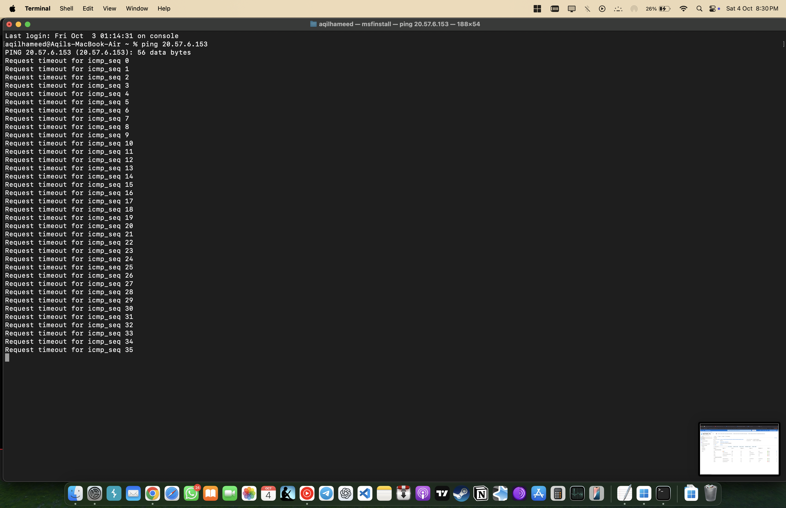

# Azure NSG & VM Connectivity

## Objective
Configure and analyze how Azure **Network Security Groups (NSGs)** control inbound and outbound access to a Windows VM with a public IP. Show how allowing/restricting specific ports and protocols (RDP, ICMP) changes real connectivity.

---

## Environment
- **Cloud:** Microsoft Azure (East US 2)
- **Host VM:** Windows 10 (Public IP assigned)
- **Client:** macOS Terminal for testing
- **Tools:** Azure Portal, RDP, Windows Defender Firewall

---

## Implementation Steps

### 1) Create Resource Group and VM
- Deploy a Windows VM with a public IP.
- Confirm associated resources (NIC, disk, IP) exist in the resource group.


### 2) Connect via RDP
- RDP to the VM to verify access.


### 3) Windows Firewall (for isolation)
- Temporarily turn off Windows Defender Firewall to observe only NSG behavior.


### 4) NSG: Allow Only RDP
- Configure inbound NSG rule to allow **TCP 3389** (RDP). Keep defaults to deny others.


### 5) Test ICMP (Before Rule)
- From macOS, ping the VM's public IP. Expect timeouts.
```bash
ping <your_vm_public_ip>
```


### 6) Add ICMPv4 Inbound Rule
- Create an inbound rule allowing **ICMPv4** to the VM.


### 7) Honeypot Simulation
- Add a permissive inbound rule (e.g., "AllowingEveryInbound") to expose the VM for monitoring.


---

## Results

| Scenario                | Expected Outcome                                 |
|-------------------------|---------------------------------------------------|
| Only RDP allowed        | Only port 3389 reachable; ICMP blocked           |
| ICMP rule added         | Ping responses succeed                            |
| All inbound allowed     | All traffic permitted; increased attack surface   |

---

## Key Learnings
- NSGs are virtual firewalls at NIC/subnet scopes and are **separate** from the OS firewall.
- Rule priority matters (lower number = higher priority).
- Opening ICMP confirms rule effectiveness quickly; opening "all inbound" is risky and should be used only for controlled experiments.

### Skills Demonstrated
- Configured and validated Azure Network Security Groups (NSGs) to control inbound and outbound traffic.
- Applied a structured testing approach: establish baseline, implement configuration changes, and verify results.
- Demonstrated understanding of network security principles and secure cloud configuration practices.

